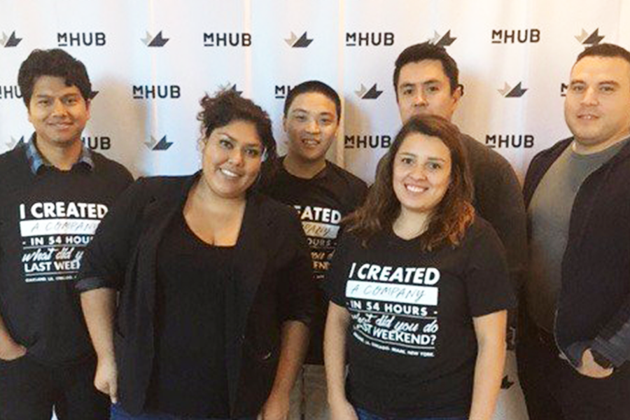
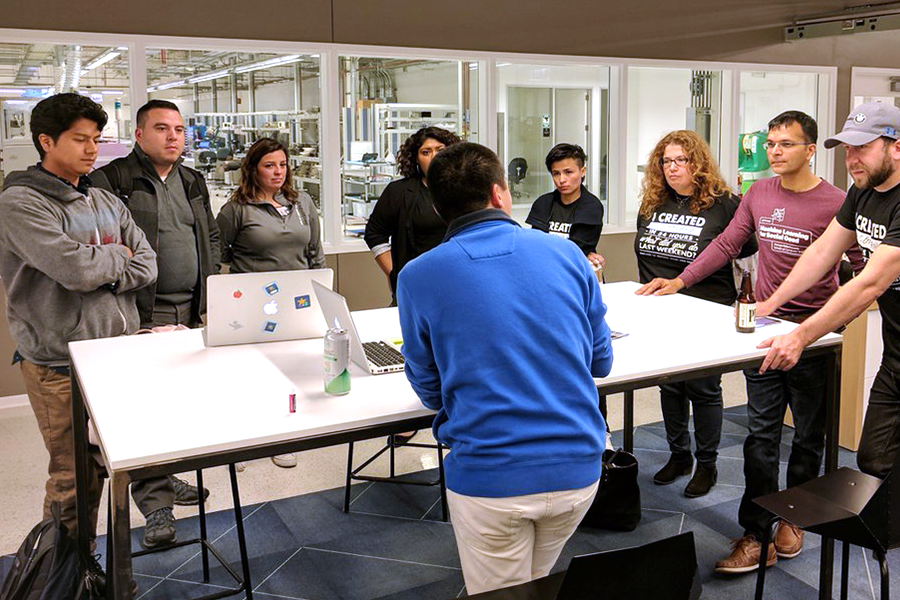

I created a company in 54h. What did you do last weekend? Reads on the t-shirt of Startup weekend. In conjunction with other great techies and entrepreneurial-minded people we participated in creating Active Citizen, an initiative in charge of simplifying policy for everyone. In the course of a weekend we crafted a business plan, executed a prototype and launch the project for final pitch on Sunday. The experience was one of kind and we’ll totally do it again. In the meantime we hope Active Citizen can develop and become a resource for all of us interested in knowing and following the the political scene a little closer. Take a look at the prototype [here](http://activecitizens.co "Active Citizen Prototype").

