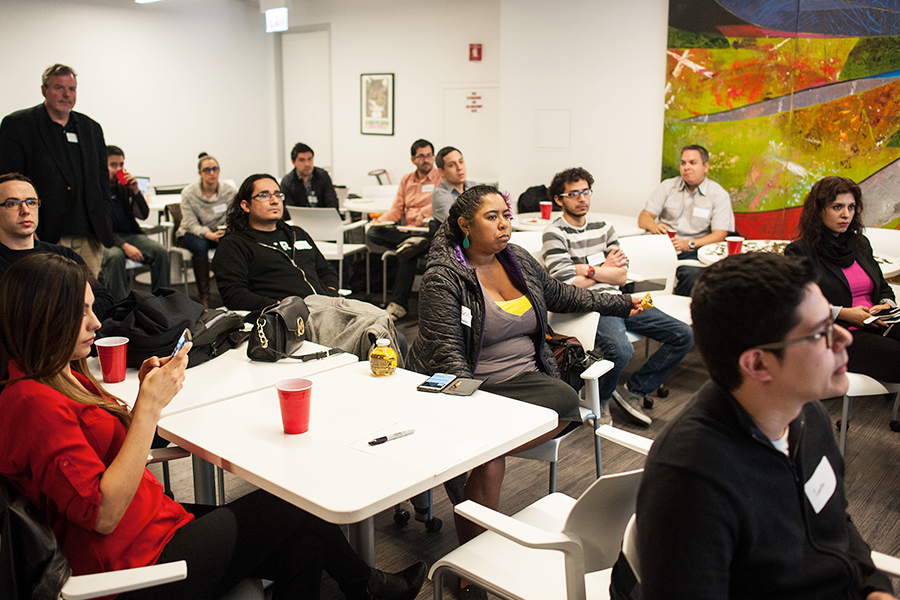

Code Latino is a Centrico Project that was born with the mission to empower the Latino community to pursue careers in Technology. Since 2015 We've been providing training and networking opportunities. We believe we can help narrow the diversity gap in the tech industry. Learn more at [codelatino.com](http://www.codelatino.com/ "Link to CodeLatino")

Photo by: William Camargo

Photo by: 1871/ Rena Naltsas
