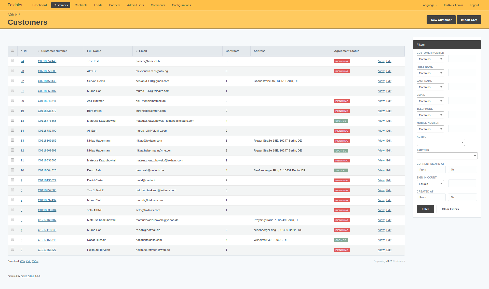
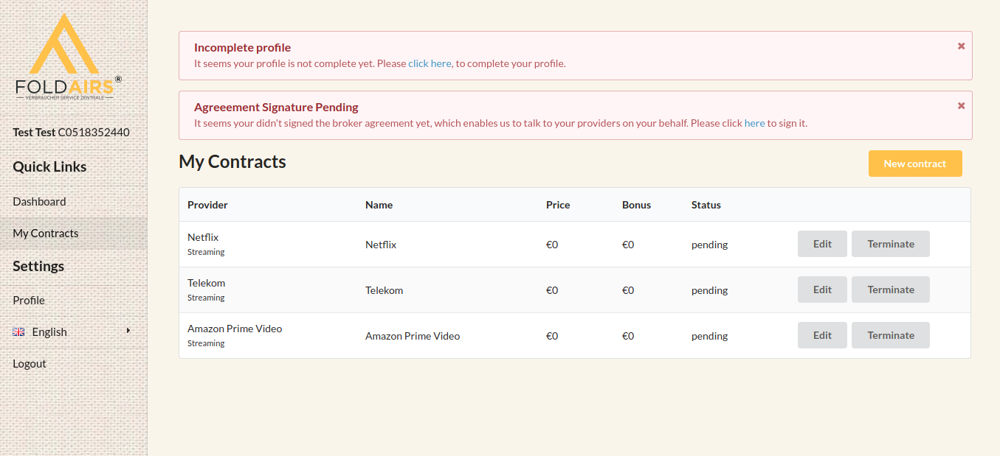

Foldairs provides affiliation services for multiple management contracts. Identifies all user’s current contracts, record their renewal-due date and then contact them, in time, with appropriate switching options. To back such a complex service our team in collaboration with Foldaris developed multiple features to streamline the process present a more stable application and improve the user experience through the user interface.

### Technologies:
- Ruby, Ruby on Rails
- Database:
- PostgreSQL
- Html, Javascript, CSS, Foundation Framework.

