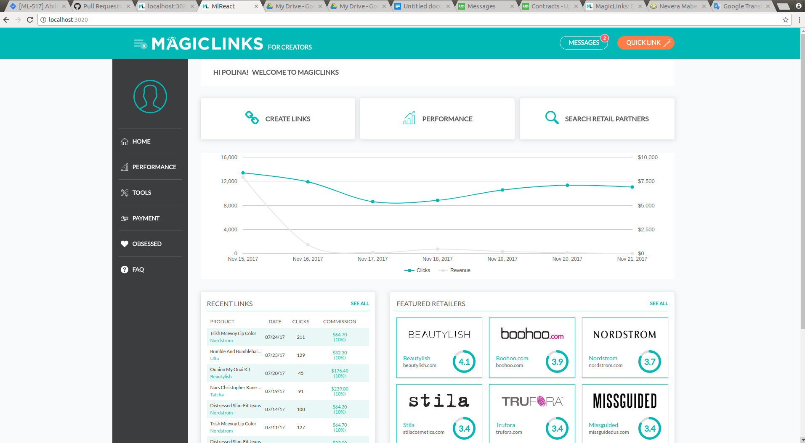
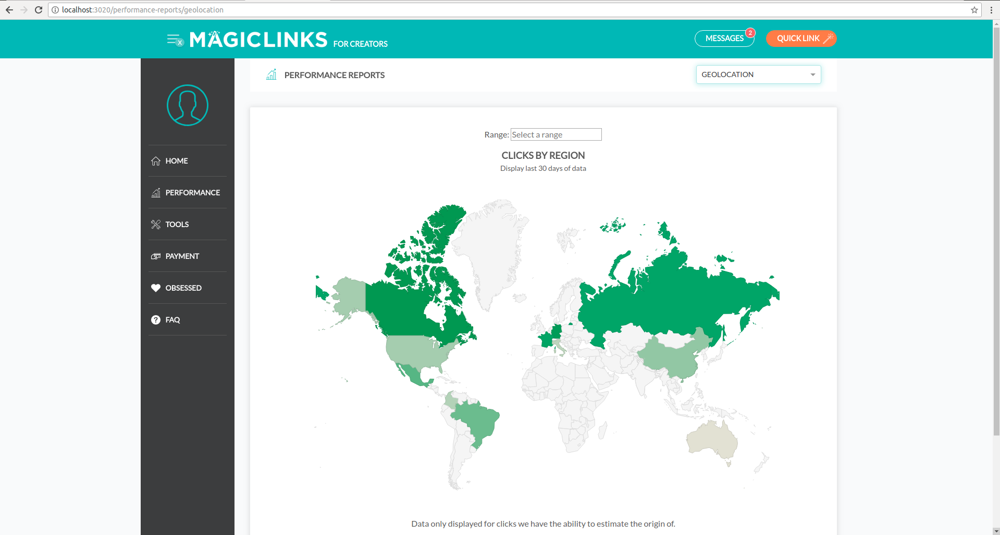

Magic Links provides tracking of sales links by affiliation. In collaboration with their team we helped expand their concept to post paid ads in YouTube, Instagram and social media influencers with authentic social commerce so that creators share products they love and earn income as their fans shop across any social platform. We act as an extension to increase Magic Links bandwidth and help them deliver features on time.

### Technologies:
- Back-end:
- Ruby, Ruby on Rails
- Database:
- PostgreSQL
- Front-end:
- ReactJS

