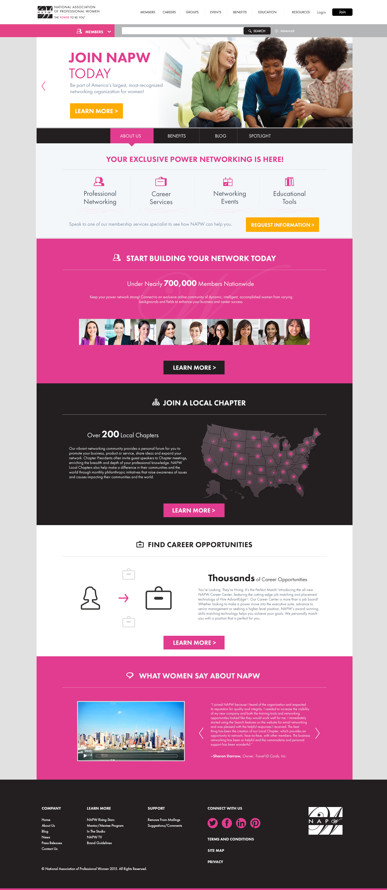
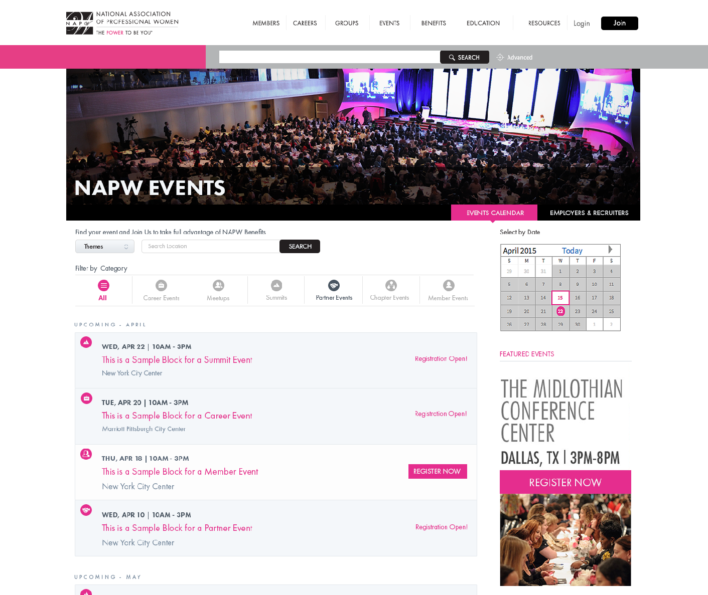

NAPW is a network of over 850.000 members and over 200 chapters across the the United States. Their public website as well as the user interface that allows members to access resources, apply for jobs, chat, post, share, follow, etc. was re-designed to be responsive and to apply their new brand as part of its initiative to expand the network. Multiple items were personalized to match the brand including icons, avatars, automated emails and more to provide a unified experience.

